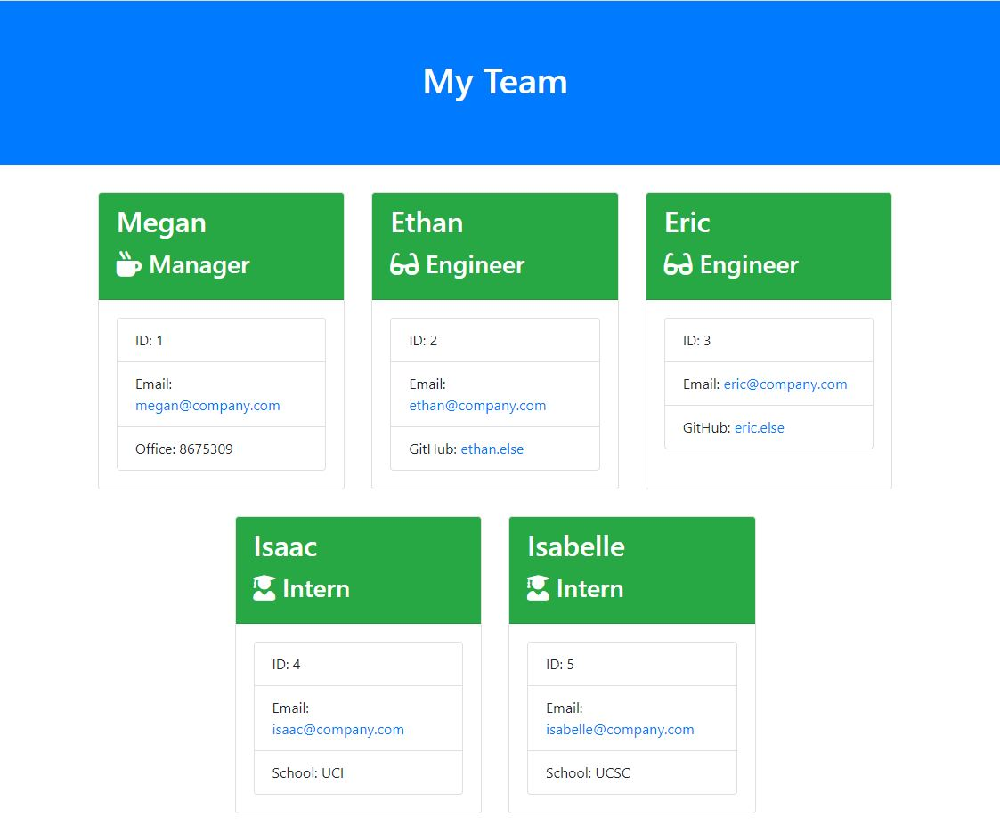

# My Team Generator

## Tutorial

https://drive.google.com/file/d/1crCn027oSe-yPX-7ZPVaqWn-Q5gtnAMr/view

## Purpose
To provide the user with an efficient solution to generating a webpage that displays a team's basic information by simply answering questions when prompted from the command line.

## Features
When the user calls the program, they are presented with questions regarding the manager's name, id, email, and office number. They are then presented with a menu that will allow them to choose to add an engineer, an intern, or finish building their team. For an engineer, they are presented with questions regarding name, id, email, and GitHub. For an Intern, they are prompted to enter name, id, email, and school. When they choose to finish bulding their team, an HTML file is generated that displays a nicely formatted team roster based on user input. The user can directly email an employee or access an employee's GitHub, directly from the html by clicking on the links.

## Built With
* HTML
* CSS
* JavaScript
* Bootstrap
* Node JS
* OOP/ TDD

## Project Status
My Team generator is compliant with defined acceptance criteria

## Contribution
Created by Jennifer Mulder
